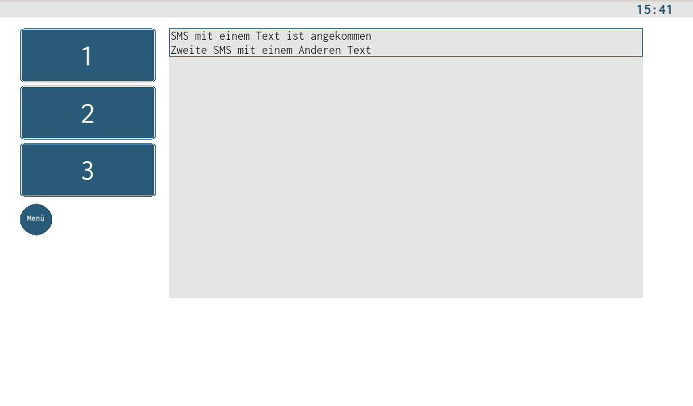
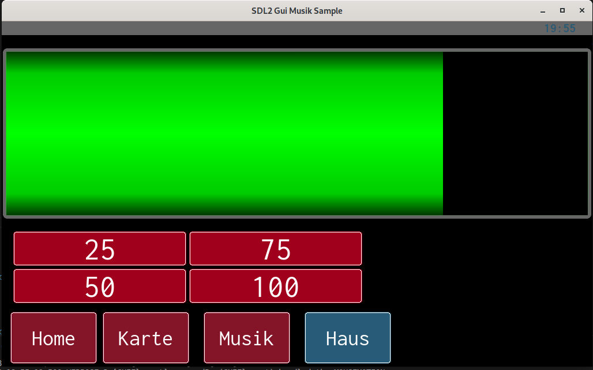
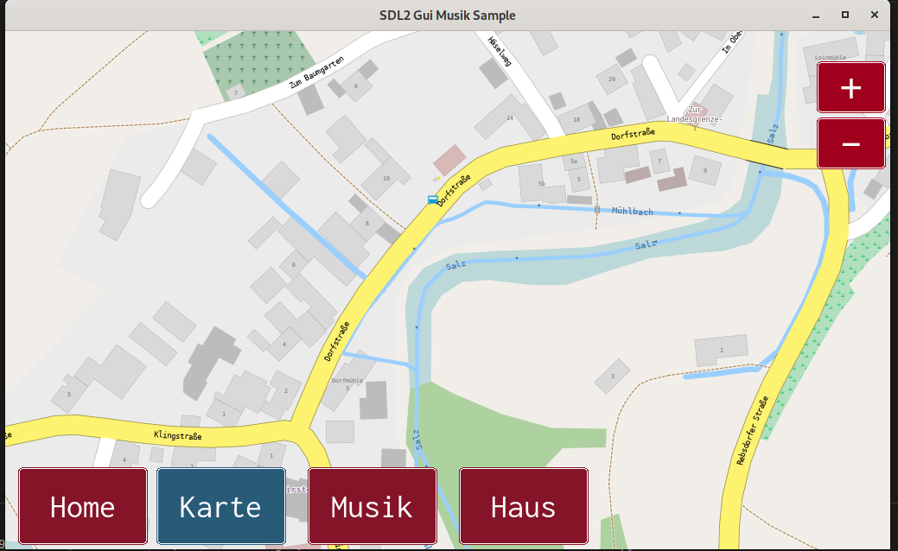

# SDL2 GUI Helper

Some Classes to Build an SDL2 Gui

at now it is an Repos to make able using in more than one projekt without copy code.

Not an Komplett Projekt there are Samples sho how to use it.

With Enabled cairo painter

## Creating Map Data

[Importing Mapdata](http://libosmscout.sourceforge.net/tutorials/importing/)

## Defines

LIBOSMSCOUT -> Enable Map Manger & Co

ENABLEAUDIOMANAGER -> Enable Audiomanger
ENABLEMUSIKMANAGER -> Enable Audiomanger need FFMPEG an can Play Mp3 and Flac files

ENABLECAIRO-> Some GUI Elements need Cairo to paint (try at now we muss test)

DEFAULT_SMALL_FONT -> Fontname for small fons

DEFAULT_FONT -> Fontname Default
